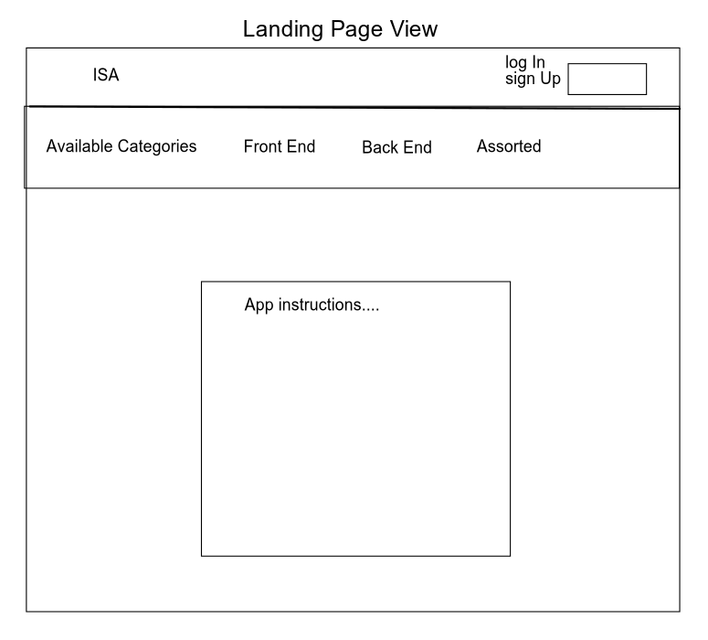

# Technical Interview Study Aid

## Version: 1.0.0

## [LIVE LINK](https://interview-study-aid.netlify.app/) | [SERVER CODE](https://github.com/Interview-Study-Aid/ISA-server)

## Overview

Technical interviews are an important -- and unavoidable! -- part of the process of entering the tech field. This full-stack application makes the preparation process as painless as possible for developers by providing a wealth of resources, all in one place. Users can choose from a variety of questions from popular tech and programming topics, view the answers on command, and log in to save their notes on a problem for future reference as they study.

Built with a React front end and Node/Express backend REST API, powered by DynamoDB.

## Authors:

- [Jennifer Chinzi](https://github.com/jchinzi)
- [Kateryna Shydlovska](https://github.com/KaterynaShydlovska)
- [Alex Whan](https://github.com/alex-whan)

## Development

### [Software Requirements](./project-info/requirements.md)

### [Conflict/Communication Plans, Workflow, & Git Process](./project-info/communication-conflict-plan.md)

### User Stories

**1. Landing Page**

As a user, I want to be able to see all available categories so that I can understand what information is available.

- Feature Tasks

  - Landing page should display all available categories
  - Each category should be clickable
  - No specific questions will be visible on landing page

- Acceptance Tests

  - Login should be available but not required to view categories
  - Multiple categories should be displayed on the navigation bar
  - No questions should be visible until a category has been selected

**2. Category View**

As a user, I want to be able to see all questions associated with the selected category so that I can choose a specific question to study in more depth.

- Feature Tasks

  - User can choose a category from a persistent navigation menu
  - Show only those questions associated with chosen category
  - Categories for both languages and topics available

- Acceptance Tests

  - The categories displayed on the nav bar should persist when a category is selected
  - The selected category should be visually indicated
  - Questions associated with the selected category should render in the body of the page
  - No answers/solutions/resources should be visible when a category is initially selected

**3. Answers**

As a user, I want to be able to view answers or resources related to the question that I'm viewing so that I can check my answers and/or gain a deeper understanding of the topic.

- Feature Tasks

  - Answers/solutions should be available for each question in the database
  - Answers/solutions should not be visible by default
  - Show answers/solutions for all visible questions

- Acceptance Tests

  - Ensure that answers and solutions to questions/challenges are not immediately visible
  - Ensure that answers are only shown when requested by the user
  - Ensure that each question has an associated answer in its record

**4. User Interface**

As a user, I want a clean, intuitive, and well-structured User Interface so that I can easily - navigate between site features while studying.

- Feature Tasks

  - Users can navigate between pages without reloading
  - Dynamic views render any updates to chosen category
  - Navigation bar and category select will be visible/available from all pages
  - Each question should be displayed on a well-defined card
  - Each question should have a detailed view with further information
  - Each question detail view should have an option to show the answer/solution
  - Show clearly-defined loading indicators when users are waiting for data

- Acceptance Tests

  - Ensure that there is a clear distinction between the "question only" view and the "question details" view to allow users to test their recall abilities when desired
  - Provide a clean and unified theme for the site for an appealing aesthetic
  - Ensure that users can navigate between views without a full-page reload
  - Provide loading indicator if users are waiting for a view to render
  - Provide a clear error message if system or view is unavailable

**5. Authorization**

As a user, I want to be able to log in to a persistent and secure profile so that I can have a - customized and personalized experience.

- Feature Tasks

  - Users can sign up with a username and password
  - Password will be encrypted and secure
  - Users can log back in and retrieve their personal data

- Acceptance Tests
  - Ensure that encrypted sample users can be retrieved from a mock database
  - Ensure that users can only access their own information and notes and not those of any other user
  - Ensure that users cannot alter site data or content
  - Ensure that passwords are not accessible
  - Ensure that users can access notes field and any saved notes when logged in

**6. Notes**

As a logged in user, I want to be able to take notes on specific study questions so that I can build on my understanding of a given topic over time.

- Feature Tasks

  - Notes will not be visible or accessible to guest users
  - Notes will be accessible to users that are authorized (logged in)
  - Detail view of a specific question will include access to a 'Notes' section
  - Notes will be editable, savable, and persistent from session to session.
  - Users can only view their personal notes (not shared with the community/other users)

- Acceptance Tests

  - Guest users should not be aware of 'Notes' as a field (ie no 'gap' in site)
  - Logged in users should be able to view an editable field ('Notes') when viewing the detail page of a - specific question
  - Notes should be persistent from session to session
  - Notes should be available only to the user they are associated with (not public)

## Domain Model

## Wireframes

## Entity Relationship Diagram

### PM Tools

- GitHub will server as a central repository for all working code and completed steps

- Trello will act as the team project management hub to maintain organization of daily tasks, measure progress toward MVP, and document individual work loads

- [Project Board via Trello](https://trello.com/b/KoWpVwCK/final-project-kanban)
